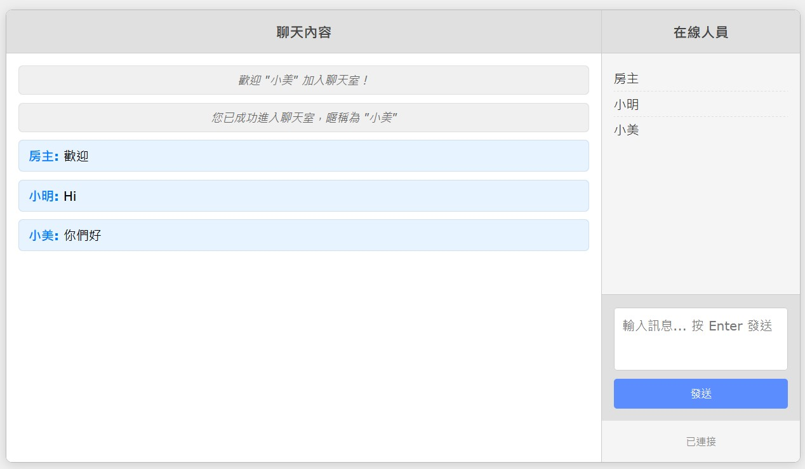

# 懷舊聊天室 (Nostalgic Chat) ✨

[](https://nostalgic-chat.glitch.me) [](https://micr0dust.github.io/nostalgic-chat)

一個基於 Node.js 和 WebSocket 的簡易網頁聊天室，無需註冊即可加入，旨在重現早期網路聊天室的簡單、即時互動體驗。

A simple web chatroom built with Node.js and WebSocket, allowing users to join without registration, aiming to recreate the experience of early internet chatrooms.

**➡️ [點此線上體驗 (Live Demo on Glitch)](https://nostalgic-chat.glitch.me) ⬅️**

## 截圖預覽 (Screenshot)



## 主要功能 (Features)

*   👤 **免註冊登入:** 輸入至少兩個字元的暱稱即可加入。
*   💬 **即時聊天:** 使用 WebSocket 實現低延遲的訊息廣播。
*   📜 **聊天內容渲染:**
    *   支援基本的 HTML 標籤渲染 (e.g., `<b>`, `<i>`)。
    *   支援貼上圖片 URL (``) 直接顯示圖片。
    *   支援貼上連結 (`<a href="...">`)。
    *   支援嵌入視頻 (e.g., 使用 `<iframe>`)。
*   👥 **在線用戶列表:** 右側即時顯示當前在線的所有用戶暱稱。
*   💨 **聊天記錄不保存:** 關閉瀏覽器或重新整理後，之前的聊天記錄即清除，符合「懷舊」和「臨時」的特性。每次進入只能看到最新的內容。
*   📱 **基本響應式:** 介面在不同屏幕寬度下有基本適應性。

## 技術棧 (Technology Stack)

*   **前端 (Frontend):**
    *   HTML5
    *   CSS3
    *   原生 JavaScript (Vanilla JavaScript)
*   **後端 (Backend):**
    *   Node.js
    *   `ws` (WebSocket 函式庫)
    *   `express` (用於提供靜態文件和處理 HTTP 請求，尤其是在 Glitch 環境下)
*   **部署 (Deployment):**
    *   Glitch.com

## 如何在本地運行 (Running Locally)

1.  **克隆倉庫 (Clone the repository):**
    ```bash
    git clone https://github.com/micr0dust/nostalgic-chat.git 
    cd nostalgic-chat
    ```

2.  **安裝依賴 (Install dependencies):**
    ```bash
    npm install
    ```

3.  **啟動伺服器 (Start the server):**
    ```bash
    npm start 
    # 或者 node server.js
    ```
    伺服器將默認在本地的 3000 端口啟動 (或 `server.js` 中指定的備用端口)。

4.  **訪問聊天室 (Access the chatroom):**
    在瀏覽器中打開 `http://localhost:3000`。

## 部署 (Deployment)

此專案目前部署於 [Glitch](https://glitch.com/)。Glitch 提供了一個方便的 Node.js 應用託管環境。主要配置請參考 `server.js` 中對 `process.env.PORT` 的監聽以及 `client.js` 中動態生成 WebSocket URL 的部分。

## ⚠️ 重要提示與限制 (Important Notes & Limitations)

*   **安全性 (XSS Risk):** 為了實現 HTML 內容渲染，前端直接使用了 `innerHTML`。這意味著用戶可以輸入惡意的 HTML 或 JavaScript 代碼 (`<script>`)，存在 **跨站腳本攻擊 (XSS)** 的風險。**此項目僅為演示目的，請勿在需要高安全性的生產環境中直接使用此渲染方式。** 若需提高安全性，應在客戶端或服務器端引入 HTML 清理庫 (如 DOMPurify)。
*   **無歷史記錄:** 聊天內容不會被儲存，這是設計特性。
*   **擴展性:** 目前的實現非常基礎，適用於少量用戶。對於大規模應用，需要更複雜的架構。
*   **暱稱衝突:** 簡單的暱稱重複檢查，高併發下可能存在問題。

## 授權 (License)

[MIT](LICENSE)